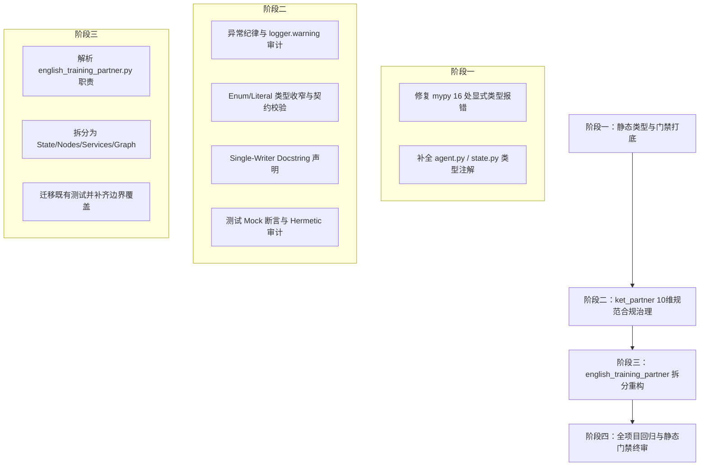

# 代码规范合规改造设计方案

**文档日期**：2026-07-29  
**相关规范**：[CLAUDE.md](../../CLAUDE.md)  
**目标**：对项目内所有代码（`src/` 与 `tests/`）进行全面代码规范合规性改造，达成静态门禁零报错、异常处理严格隔离、类型契约严密以及代码/测试质量合规。

---

## 一、改造背景与目标

### 1.1 背景
通过静态检查工具与代码探索发现：
1. `ruff check .` 目前通过，但 `mypy src` 存在 16 处静态类型报错（集中在 `src/flow/agent.py` 与 `src/flow/english_training_partner.py`）。
2. 项目中包含一个 >1600 行的超大单文件 `src/flow/english_training_partner.py`，严重违背 [CLAUDE.md](../../CLAUDE.md) 第四条（代码组织）与第十条（模块分层与依赖方向）。
3. 需全量审计 `src/flow/ket_partner/` 下的 20 个源码模块与 20 个测试模块，对齐异常捕获、Single-Writer 状态声明、枚举类型收窄以及 Mock 测试断言。

### 1.2 改造目标
- **静态门禁零报错**：`ruff check .`、`mypy src` 及 `pytest` 全部绿灯通过。
- **异常捕获规范**：消除裸 `except` / 捕获 `ValueError/TypeError` 等 bug 类异常的静默兜底，补齐 `logger.warning(..., exc_info=True)`。
- **类型契约严密**：状态与分类字段收窄为 `Enum`/`Literal`，跨边界元组解包强制使用命名解包。
- **测试断言有效性**：所有使用 Mock 的单元测试必须具备 `call_count`/`await_count` 或 `assert_called*`/`assert_awaited*` 断言。
- **模块解耦拆分**：将 `english_training_partner.py` 拆分为独立子包 `src/flow/english_training_partner/`，各 Node 函数行数控制在 80 行以内。

---

## 二、三阶段实施方案设计



### 2.1 阶段一：静态类型与门禁打底

修复 `mypy src` 现存的 16 处显式类型报错：

1. **`src/flow/agent.py` 修复项**：
   - 修复 L74 `hools` 缺失类型标注问题（标注为 `tools_map: dict[str, Any]`）。
   - 修复 L107 `messages` 类型不匹配（标注为 `list[BaseMessage]`）。
   - 修复 L133 `AIMessage | ...` Union 类型未做 `isinstance(msg, AIMessage)` 收窄即访问 `.tool_calls` 的隐患。
   - 修复 L177 `Literal` 语法格式错误。
   - 统一 L191/L205 `get_tool_call_signature` 入参注解为 `Sequence[ToolCall | dict[str, Any]]`。
2. **`src/flow/english_training_partner.py` 修复项**：
   - 修正 L537/L539 `append/extend` 在消息列表上的类型冲突。
   - 补充 L906 `categories` 缺失的字典类型注解。
   - 解决 L1217/L1218 `AnalysisOutput` 与 `ErrorKeyOutput` 赋值不兼容及缺失 `error_key` 属性的问题。
   - 补充 L1655 `test_cases` 显式类型注解。

### 2.2 阶段二：`ket_partner` 核心模块 10 维规范合规治理

对 `src/flow/ket_partner/`（20个源码文件）与 `tests/ket_partner/`（20个测试文件）按 10 维规范精细化重构：

1. **异常处理纪律**：
   - 审计所有 `try/except` 块，禁止在非适配层捕获 `ValueError/TypeError` 等代码 bug 异常；所有 fallback 均补齐 `logger.warning("...", exc_info=True)`。
   - 校验跨边界返回值非空与类型有效性。
2. **类型与契约正确性**：
   - 将开放 `str`（路由状态、对话阶段 `phase`、题型等）全面替换为 `Enum` 或 `Literal[...]`。
   - 跨模块函数返回值消除裸多元组索引访问（如 `res[0]`），替换为命名解包（`a, b = func()`）或 `dataclass`。
3. **状态与可变性**：
   - 在 `state.py` 属性上逐字段标注 Single-Writer 说明：`- field_name: 仅 <写入者> 在 <条件> 时写；<其他位置> 只读`。
4. **代码组织**：
   - 函数多于 80 行或分支 > 3 提取为辅助函数；硬编码映射封装为模块级常量。
5. **测试规范合规**：
   - 给 `tests/ket_partner/` 中所有使用 Mock 的测试用例加补 `call_count` / `await_count` 或 `assert_called*` / `assert_awaited*` 断言。

### 2.3 阶段三：`english_training_partner.py` 模块化拆分

将 1600+ 行的单文件拆分成独立包 `src/flow/english_training_partner/`：

```
src/flow/english_training_partner/
├── __init__.py                # 对外接口与门面 (Facade)
├── state.py                   # State 状态对象（含 Single-Writer docstring）
├── schemas.py                 # Pydantic Schema 定义
├── constants.py               # 常量、枚举与查表
├── prompts.py                 # LLM Prompt 模板
├── services.py                # 跨边界 LLM 调用服务（ Protocol 抽象与依赖注入）
├── nodes/                     # 各独立节点（每个节点函数 <= 80 行）
│   ├── __init__.py
│   ├── evaluator_node.py
│   ├── dialogue_node.py
│   └── feedback_node.py
└── graph.py                   # LangGraph 图编排
```
* **向下兼容**：保留原 `src/flow/english_training_partner.py` 作为入口 Facade 重新导出核心符号，避免影响上层 API 与集成测试。

---

## 三、质量门禁与验证机制

每阶段完成后，必须按顺序执行以下验证命令：

1. **Ruff 校验**：
   ```bash
   ruff check .
   ```
2. **Mypy 静态类型校验**：
   ```bash
   mypy src
   ```
3. **Pytest 回归测试**：
   ```bash
   pytest
   ```
所有命令返回码必须为 `0` 且无报警，方能视为合规完成。
